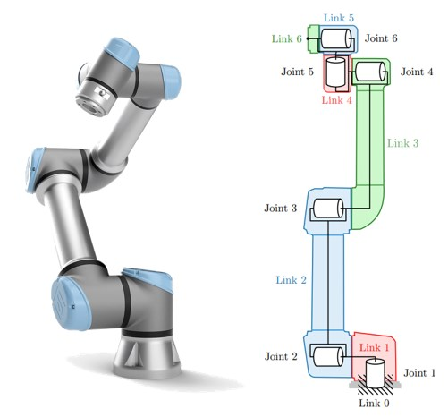

# Modelling and Controlling a UR5 Robot

## Overview
This repository contains the implementation and analysis of kinematic and dynamic control strategies for the UR5 robotic arm, developed for the Advanced Robotics course. The project encompasses **forward/inverse kinematics**, **Jacobian-based trajectory planning**, **dynamic modeling**, and **multiple control schemes** (PD, PID, feedback linearization) validated in MATLAB/Simulink. Key contributions include singularity avoidance, gravity compensation, and trajectory tracking under real-world constraints.

  

---

## Project Structure
The final report and implementation are organized as follows:
- **Kinematic Analysis**: DH parameters, forward/inverse kinematics, Jacobian, singularities.
- **Dynamic Analysis**: Mass matrix, Coriolis/centrifugal terms, gravity vector, Euler-Lagrange formulation.
- **Controllers**: Regulation, trajectory tracking, and Cartesian-space control.
- **Simulations**: MATLAB/Simulink models for control validation.
- **Results**: Performance metrics for all controllers.

---

## Key Features
### 1. **Kinematic Analysis**
- **Forward Kinematics**: Derived transformation matrices using DH parameters.
- **Inverse Kinematics**: Geometric solutions for joint angles (8 possible configurations).
- **Jacobian Matrix**: Computed linear/angular velocity relationships and singularity conditions (elbow, wrist, shoulder).
- **Trajectory Planning**: Pseudo-inverse Jacobian method with cubic interpolation.

### 2. **Dynamic Modeling**
- **Mass Matrix (\(M\))**: Inertia properties derived using Euler-Lagrange.
- **Coriolis/Centrifugal Matrix (\(C\))**: Velocity-dependent terms.
- **Gravity Vector (\(G\))**: Compensation for gravitational forces.
- **Linear Parametrization**: Regressor matrices for adaptive control.

### 3. **Control Strategies**
#### Regulation
- **PD Control**: With/without gravity compensation.
- **PID Control**: Integral action for steady-state error reduction.
- **Iterative Learning Control (ILC)**: Adaptive gravity compensation.

#### Trajectory Tracking
- **Inverse Dynamics + PD**: Feedforward compensation for trajectory following.
- **Feedback Linearization (FBL)**: Combined with PD/PID for error minimization.

#### Cartesian-Space Control
- **Task-Space PD**: End-effector position control with joint-space damping.
- **Input/Output Linearization**: Model-based decoupling (limited by computational complexity).

  

---

## Key Results
- **Regulation**: 
  - PD with exact gravity compensation achieved **zero steady-state error** (Fig. 12).
  - ILC reduced gravity estimation error by **90%** over iterations (Fig. 19).
- **Trajectory Tracking**: 
  - Inverse dynamics + PD achieved **<0.5% tracking error** (Fig. 22).
  - Feedback linearization + PID eliminated steady-state drift (Fig. 27).
- **Singularity Handling**: Damped Jacobian prevented instabilities near singular configurations.

  

---

## Tools & Methods
- **MATLAB/Simulink**: Symbolic math, control system design, simulation

